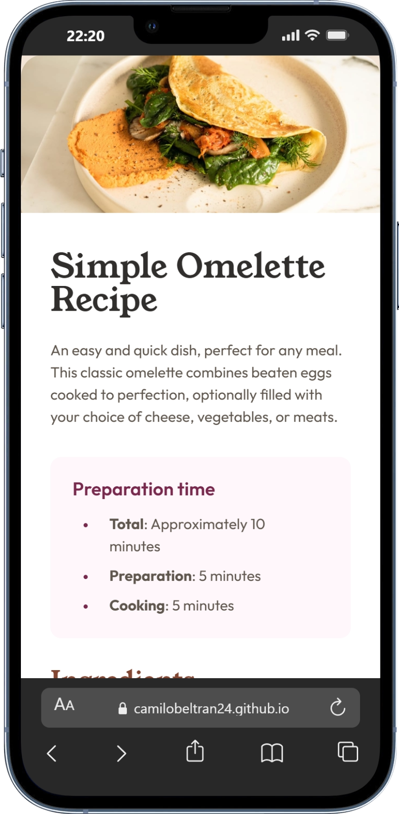

# Frontend Mentor - Recipe page solution

This is a solution to the [Recipe page challenge on Frontend Mentor](https://www.frontendmentor.io/challenges/recipe-page-KiTsR8QQKm). Frontend Mentor challenges help you improve your coding skills by building realistic projects.

## Table of contents

- [Overview](#overview)
  - [Screenshot](#screenshot)
  - [Links](#links)
- [My process](#my-process)
  - [Built with](#built-with)
- [Author](#author)
- [Acknowledgments](#acknowledgments)

## Overview

### Screenshot

### Links

- [Frontend Mentor Solution URL](https://www.frontendmentor.io/solutions/recipe-page-5g0k4VgUqr)
- [Live Site URL](https://camilobeltran24.github.io/_frontendMentor-Recipe-page/)

## My process

### Built with

- Semantic HTML5 markup
- CSS
- Vuejs

## Author

- Website - [Christian Camilo Beltran](https://www.linkedin.com/in/camilobeltran24/)
- Frontend Mentor - [@CamiloBeltran24](https://www.frontendmentor.io/profile/CamiloBeltran24)

